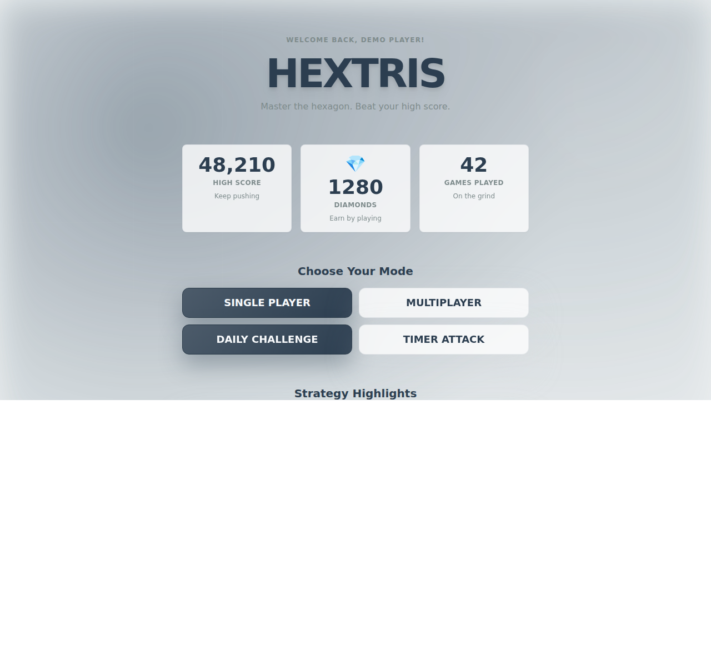

# Hextris Mode Strategy Blueprint

This plan outlines gameplay goals, rules, and progression hooks for each major mode plus a refreshed difficulty ladder. It is structured so engineers can extract requirements while designers keep creative intent aligned.

## Implementation Status (Feb 14, 2026)
- **Delivered**
	- Expanded five-tier difficulty schema with surge/adaptive metadata wired into config, menu selection flows, and GamePage runtime.
	- WaveSystem now schedules surge windows plus adaptive assist triggers, and UI shows surge overlays/tempo state.
	- Daily Challenge and difficulty menu options reference the new tiers, ensuring Fierce/Apex access pathways align with the roadmap.
	- Added menu-facing strategy highlights for Single Player, Multiplayer, Daily Challenge, and Timer Attack so players see concise play tips before launching a mode.
- **Outstanding**
	- HUD/audio cues for surge, tempo, and strategy phase states plus milestone loot surfacing.
	- Combo heat meter system, multiplayer momentum mechanics, challenge scripting tools, and Timer Attack time orbs.

## Strategy Highlight Screenshot

## 1. Shared Design Pillars
- **Readable pressure curve**: every 30–45 seconds should noticeably change spawn rhythm, obstacle mix, or rewards.
- **Player clarity**: HUD communicates remaining lives, streak rewards, and any timed modifiers (slow-mo, shields, etc.).
- **Economy loop**: all modes return diamonds + cosmetics, but the best earners are tasks that promote skill expression (combos, perfect waves).
- **Live tuning knobs**: each mode exposes spawn multiplier, hazard bias, power-up odds, and bonus cadence so balance patches are straightforward.

## 2. Core Difficulty Framework
*Status: Implemented — tier metadata, surge cadence, and adaptive assists are live in config/difficulty.ts, GamePage, and WaveSystem.*
| Tier | Name | Speed Scalar | Spawn Density | Hazards | Power-Up Drop | Notes |
| --- | --- | --- | --- | --- | --- | --- |
| 0 | Discovery | 1.0× | 0.75× | Disabled | 1.25× | Tutorial pacing, unloseable demo.
| 1 | Easy | 1.4× | 0.9× | Light | 1.1× | Current entry point but with early warning bells.
| 2 | Standard | 1.8× | 1.0× | Normal | 1.0× | Baseline leaderboard category.
| 3 | Fierce | 2.2× | 1.2× | Advanced | 0.9× | Adds counter-rotating waves + shield-breakers.
| 4 | Apex | 2.6× | 1.35× | Brutal | 0.8× | Unlock via prestige; introduces "fracture" rows.

Additional knobs:
- **Surge Events**: $\text{surge}_{n}=30+20n$ seconds triggers 6-second spike in spawn by +0.4×.
- **Adaptive Assist**: drop speed -0.2× for 10 seconds if player loses two lives inside 15 seconds (tiers 0–2 only).
- **Prestige Mutators**: optional toggles that multiply score (e.g., mirrored input, no power-ups) for endgame.

## 3. Mode Playbooks

### 3.1 Single Player (Lives-Based Marathon)
*Status: Partially implemented — tier escalation and surge/adaptive hooks exist; combo heat meter, milestone loot, and music layering are pending.*
**Goals**: long-form mastery, leaderboard chase, experimentation with mutators.

**Strategy Highlights (Menu Surface)**
- Keep the center low for safe rotations.
- Save shields for surge windows.
- Chain clears to build combo heat.

**Structure**
1. **Opening Calm (0–60s)**: Discovery/Easy blend, extra slow-mo drops to onboard.
2. **Flow Phase (60–240s)**: Standard tier. Introduce rotating hazard arcs that demand directional swaps.
3. **Pressure Phase (240s onward)**: escalate to Fierce; surge events every 45s; boss wave every 120s with patterned color locks.
4. **Prestige Apex** (opt-in): adds Apex tier + mutators for x1.4 score multiplier.

**New Features**
- **Combo Heat Meter**: sustained clears fill meter; at thresholds grant short-lived perks (auto-hammer burst, point multipliers).
- **Dynamic Music Layering**: tie soundtrack layers to tier so pressure feels audible.
- **Milestone Loot**: at 2, 5, 10 minutes award themed cosmetics/inventory boosts.

### 3.2 Multiplayer (Co-op Competitive Hybrid)
*Status: Pending — no multiplayer momentum/catch-up systems have been implemented yet.*
**Modes**
1. **Race**: first to reach target score/time survives hazard spikes. Shared surge timer so both fields heat simultaneously.
2. **Sabotage** (unlocked at Standard tier): clearing perfect rings sends glitch blocks to rivals.
3. **Sync Survival**: duo shares life pool; periodic team challenges (e.g., clear 4 reds in 10s) grant shields.

**Systems**
- **Group Momentum Bar**: performing objectives fills bar unlocking temporary buffs (global slow-mo, double diamonds).
- **Catch-Up Rubber Band**: trailing player gets +0.1× power-up odds, but only if difference >25% score.
- **Live Events**: server can broadcast weekend modifiers (e.g., "Twin Hammers" event gives unique effect + leaderboard badge).

**Strategy Highlights (Menu Surface)**
- Push perfect rings to fill momentum.
- Spend power-ups defensively during surges.
- Time your push when rivals stall.

### 3.3 Daily / Weekly Challenges
*Status: Pending — challenge seeds, scripted timelines, and reward tracks still need engineering support.*
**Daily**
- Fixed seed layout + curated mutator (e.g., mirrored input). Score-based leaderboard resets every 24h.
- **Difficulty steps**: Discovery for first 30s, then Standard but with scripted hazard timeline to keep fairness.
- Reward track: bronze/silver/gold chests = cosmetics, diamonds, booster charges.

**Strategy Highlights (Menu Surface)**
- Scan today’s mutator before the first drop.
- Bank hammers for scripted spikes.
- Prioritize survival over speed.

**Weekly Gauntlet**
- Five sequential stages, each locking a different mutator/difficulty pair (e.g., Stage 3 = Fierce + no shields).
- Shared life stack across stages; restock only after stage completions.
- Scoring weights later stages heavier; leaderboard focused on consistency.

### 3.4 Timer Attack
*Status: Pending — tempo ramps, time orbs, and ghost comparisons remain to be built.*
**Objective**: maximize points inside chosen duration (30 / 60 / 120 / Endless Rush).

**Enhancements**
- **Tempo Ramps**: every 15 seconds increase spawn scalar by +0.05× so short runs still escalate.
- **Time Orbs**: perfect clears spawn orbs; collecting three grants +5 seconds (cap per duration to keep balance).
- **Threat Pacing**: use hazard playlist so final 10 seconds feel explosive (e.g., double-color waves, instant-drop streaks).
- **Ghost Comparisons**: show best personal pace as translucent stack to motivate.

**Strategy Highlights (Menu Surface)**
- Clear quickly to spawn time orbs.
- Rotate early to avoid dead zones.
- Attack combos in the final countdown.

## 4. Feature Backlog Starters
1. Surface surge/tempo/phase states in HUD + audio plus add telemetry hooks for milestone loot drops.
2. Build combo heat meter UI + logic.
3. Multiplayer momentum bar + catch-up balancing hooks.
4. Challenge seed scripting tool (JSON descriptors for waves, mutators, rewards).
5. Timer Attack time orb entity + HUD integration.

## 5. Rollout & Telemetry
- **Phase A**: prototype surge + combo meter in dev builds; capture completion rates per tier.
- **Phase B**: A/B test Timer Attack time orbs; log whether players extend runs >20%.
- **Phase C**: ship weekly gauntlet with limited reward pool; monitor retention delta for challenge players.
- **Telemetry Hooks Needed**: difficulty tier reached, surge survival %, combo heat uptime, multiplayer momentum usage, challenge completion time.

---
This document should be treated as the living source of truth for gameplay direction; update it as features graduate from concept to production.
